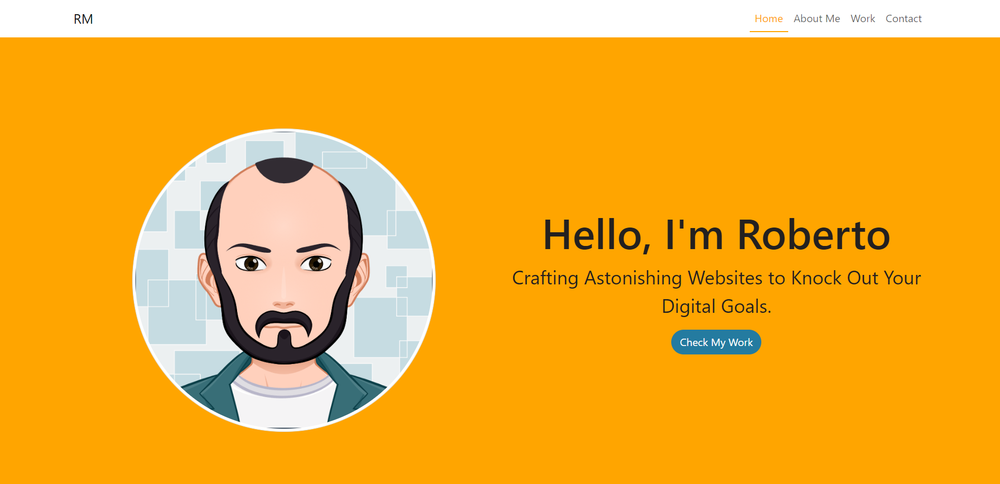

# Bootstrap-Portfolio

Welcome to my portfolio website repository! In this project, I've recreated a professional and visually appealing layout for showcasing my work using the Bootstrap CSS Framework. Its design highlights my skills, projects, and experiences in web development.

## Features

**Collapsible Navbar (Bootstrap):**

- A collapsible navbar to navigate effortlessly through the portfolio.

**Clean and Modern Design:**

- A visually appealing and modern design tailored for a professional presentation.

**Responsive Layout:**

- A responsive layout that ensures a seamless and visually pleasing experience across all devices.

**Hero Section with Avatar and CTA:**

- An engaging hero section featuring a captivating avatar and a compelling call to action.

**About Section:**

- An About Me section, providing insights into passion and commitment to learn more about the developer behind the code.

**Work Section:**

- A collection of projects showcasing skills in HTML, CSS, JavaScript, PHP, and more.

**Skills Section:**

- To Showcase expertise with a dedicated "Skills" section, highlighting proficiency in HTML, CSS, JavaScript, Git, GitHub, UI/UX, jQuery, React, and more.

**Contact Form:**

- A user-friendly contact form in the "Contact Me" section, inviting potential employers and clients to reach out.

**Footer with Copyright and Hyperlinks:**

- A sleek footer featuring a copyright notice for the current year and hyperlinks to critical sections of the portfolio. Experiencing a subtle shadow effect on link hover.

## Resources

- HMLT | CSS | JavaScript | Bootstrap
- [jQuery Smooth Scroll](https://www.w3schools.com/howto/howto_css_smooth_scroll.asp) --> used to break the abruptly moving from links inside a page.
- [Box Shadow CSS Generator](https://cssgenerator.org/box-shadow-css-generator.html) -- > online platfor to help to create css effects efficiently.
- [Coolors](https://coolors.co/) --> platform to help to chosen the best color matching.
- [Huemint](https://huemint.com/) --> similar to coolors, it helps on choosing the best color for the website.
- [MDM Web Docs](https://developer.mozilla.org/en-US/docs/Web/API/Document/DOMContentLoaded_event) --> to apply to the scroll function.
- [w3Schools](https://www.w3schools.com/jsref/met_win_scrollto.asp) --> to apply to the scroll function.

## To Access

[View my portfolio website](https://rober-web.github.io/Bootstrap-Portfolio/)
